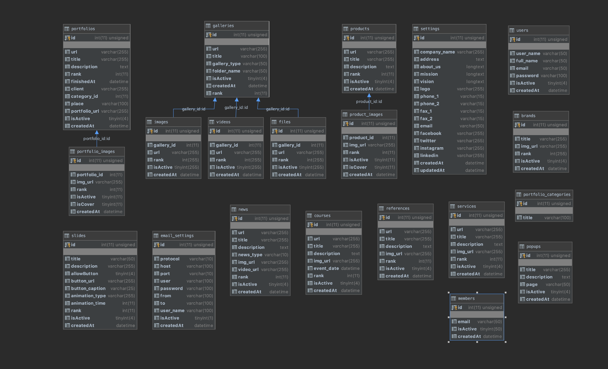
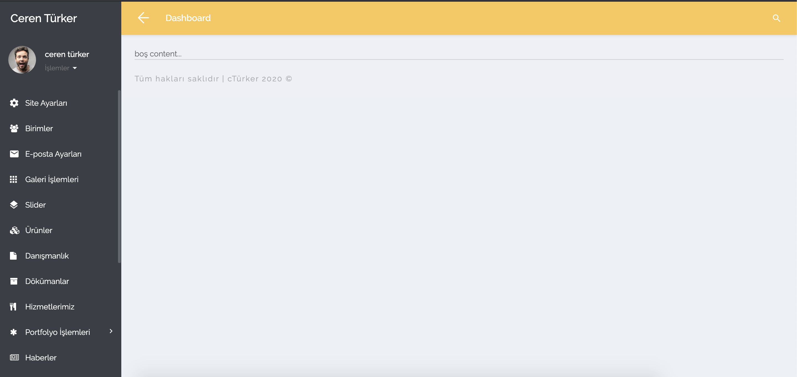
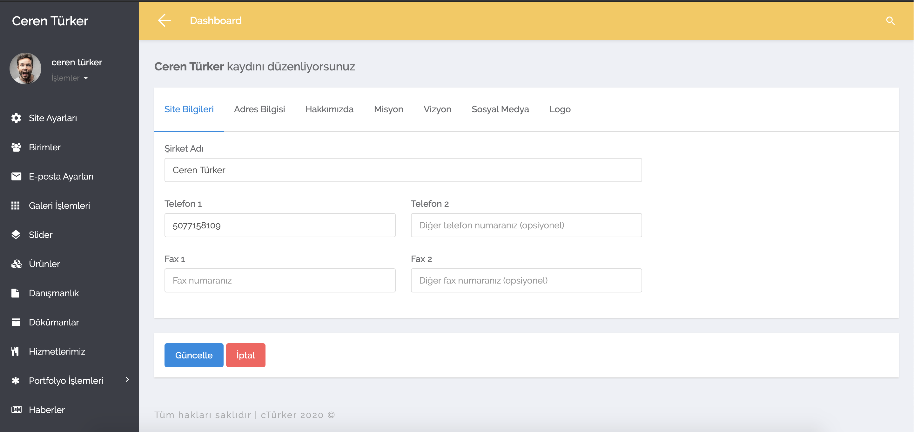
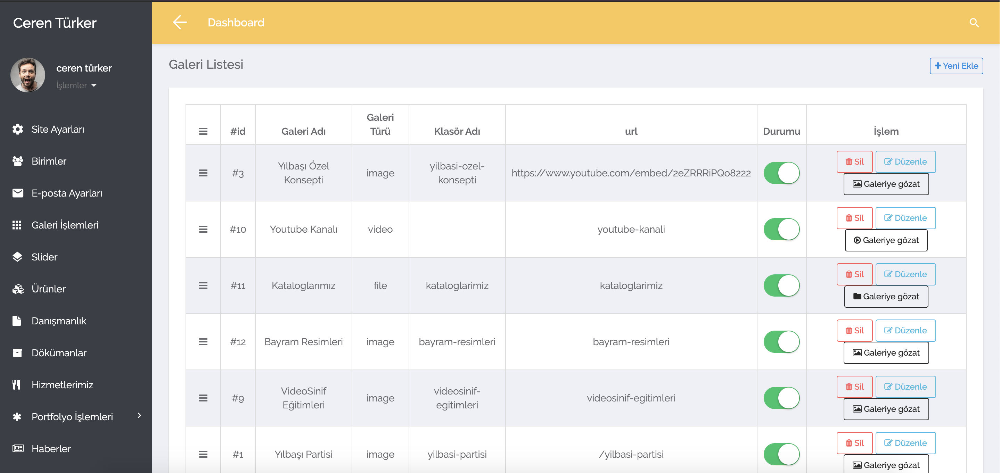
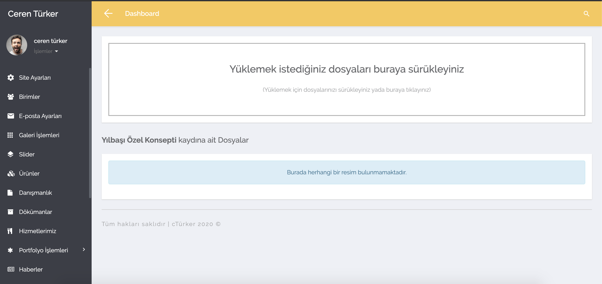

# Admin Paneli Yapımı
Codeigniter ile Sıfırdan admin paneli kodlarıdır.Eğer isterseniz kendi sitenizi dinamikleştirip bu admin panelinden kaydettiğiniz verileri kendi sitenize çekebilirsiniz.Bu panelde neler var gelin bakalım.

•	**Dropzone** ile dinamik olarak **çoklu dosya aktarımı**

•	**Sortable** ile **dinamik olarak veri sıralaması**

•	**Toggle** ile **dinamik olarak durum değiştirme**

•	**Alert Sistemi** Mantığı

•	**Login, Logout** süreçleri, **Şifremi Unuttum** süreçleri

•	**E-mail** yapılandırması

•	**Dosya Upload** İşlemleri

•	**SESSION** İşlemleri

•	**Form Validation** ile Veri Kontrolü

•	Codeigniter ile **Library** Oluşturmak

 
 
